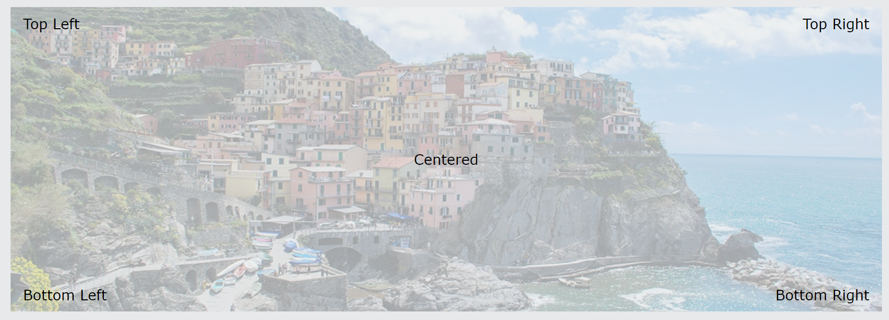
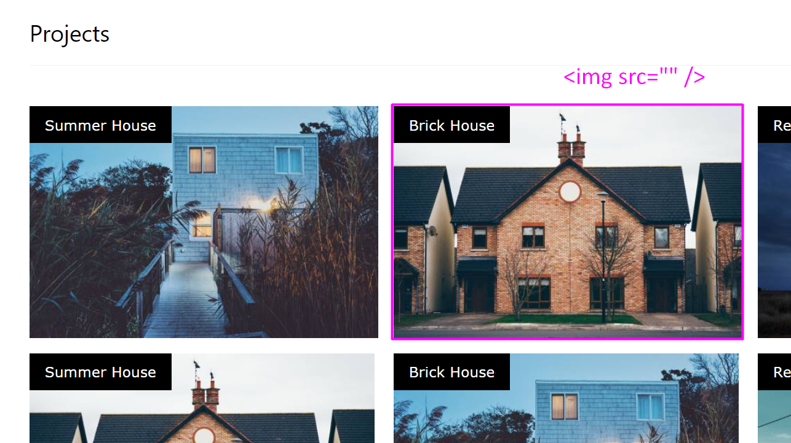

# Pasidarom

1. Naujas projektas. sukurti div ir i ji ideti paveiksleli ir 5 paragrafus. isdelioti paragrafus kaip nurodyta nuotraukoje 
2. Is architektu puslapio persidaryti viena eile namu nuotrauku, kad nuotraukos butu ne fone bet ikeltos kaip IMG paveiksleliai htmle. 
3. https://www.w3schools.com/w3css/tryw3css_templates_coming_soon.htm
4. https://www.w3schools.com/w3css/tryw3css_templates_wedding.htm
